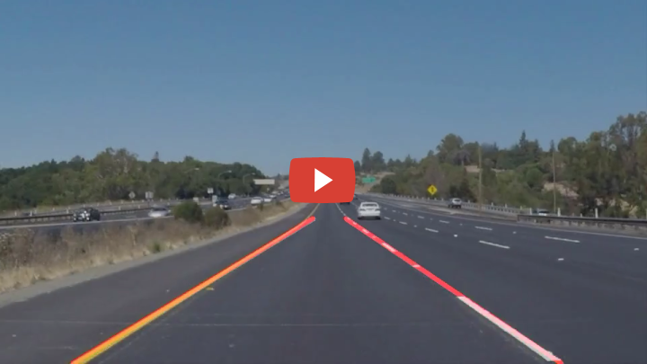

## Python Command Line Video Utilities

Python Command Line Utilities for videos

### Generate a Youtube Video preview image that works in markdown

Currently, to embed a video such as youtube video, you need to include the iframe into the html. This is a problem in markdown as iframes are not allowed.

[Stack Overflow](https://stackoverflow.com/questions/11804820/embed-a-youtube-video) has a nice solution around it. Instead of inserting the iframe, insert a video preview image to indicate to user it is a video. The image will however be a link to the youtube site instead of embedded in the page. It is a nice hack. 

However, to make the preview image look like a video, you need to capture a screen shot of the video. There should be an easier alternative. After not having much luck finding such tool, I decide to make one.

#### Requirements
`cv2`, `PIL`, `numpy`

#### Usage
``` 
gen_youtube_preview.py IMAGE [output image width=720]
 -OR-
gen_youtube_preview.py VIDEO FRAME [output image width=720]
Eg.
gen_youtube_preview.py path/to/video.mp4 1
```

or for generic (non-youtube) play triangle icon:

``` 
gen_preview.py IMAGE [output image width=720]
 -OR-
gen_preview.py VIDEO FRAME [output image width=720]
Eg.
gen_preview.py path/to/video.mp4 1
```

This will generate a video preview image and print out the markdown syntax to link the video with the preview image.




#### Credits
Youtube icon source: https://github.com/halgatewood/youtube-thumbnail-enhancer
(Icon seems a bit different than current youtube one. If anyone has a better source, please let me know.)